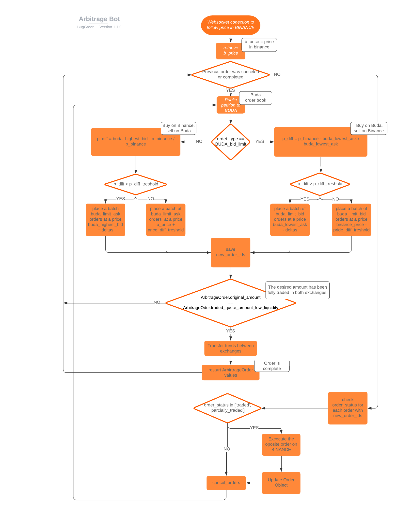

# ArbitrageBot

## Project Overview

ArbitrageBot is a Python-based tool designed to execute arbitrage trading strategies between two cryptocurrency 
exchanges. The bot is designed to handle trading on a **low liquidity exchange** and a **high liquidity exchange**. 
Currently, the logic supports **Buda** (low liquidity) and **Binance** (high liquidity) exchanges, with plans to expand 
support for additional exchanges in the future.

The primary goals of this project include:

1. Developing efficient arbitrage strategies between exchanges with varying liquidity levels.
2. Creating a modular and extensible structure to easily integrate new exchanges.
3. Ensuring reliable and scalable order execution.

---

## Project Structure

The project is organized within the `src` folder, which contains the following modules:

### 1. `arbitrage_bot`
- Contains the `ArbitrageBot` class, which defines the core functionality for:
  - Connecting to exchanges.
  - Identifying arbitrage opportunities.
  - Executing buy and sell orders.
- Includes:
  - **Unit tests** to ensure the reliability of the bot.
  - Constants specific to arbitrage operations.
  - [**Documentation**](./src/arbitrage_bot/README.md) of the **ArbitrageBot** class and its methods.

### 2. `exchange_api`
- Provides API integrations for supported exchanges through:
  - **`base_exchange`:** An abstract class that defines the base structure for any exchange API.
  - **`binance_proxy`:** A concrete class implementing Binance API-specific functionality.
  - **`buda_proxy`:** A concrete class implementing Buda API-specific functionality.
- Includes:
  - **Unit tests** for API methods.
  - Constants specific to each proxy module.

### 3. `order_types`
- Handles order-related logic through the following modules:
  - **`order.py`:** Defines an abstract class for generic orders.
  - **`arbitrage_order.py`:** Implements the `ArbitrageOrder` class to store and manage arbitrage order details.
  - **`encoders.py`:** Contains encoders specific to the serialization and handling of orders.

---

## Current Functionality
- **Exchanges Supported:** Buda and Binance.
- **Core Features:**
  - Arbitrage opportunity detection.
  - Secure and efficient order execution.
  - Modular structure for scalability.

---

## Future Development
Plans for future iterations of ArbitrageBot include:
- Expanding support to additional exchanges beyond Binance and Buda.
- Enhancing performance to optimize high-frequency arbitrage strategies.
- Improving error handling and logging mechanisms for robustness.

---

## Workflow Overview
Below is an image illustrating the logical workflow of ArbitrageBot, from detecting arbitrage opportunities to executing trades:

---

## Getting Started
1. Clone this repository.
2. Navigate to the `src` folder to explore the modules.
3. Follow the workflow diagram to understand how the logic flows between modules.
4. Run the unit tests to verify functionality.

